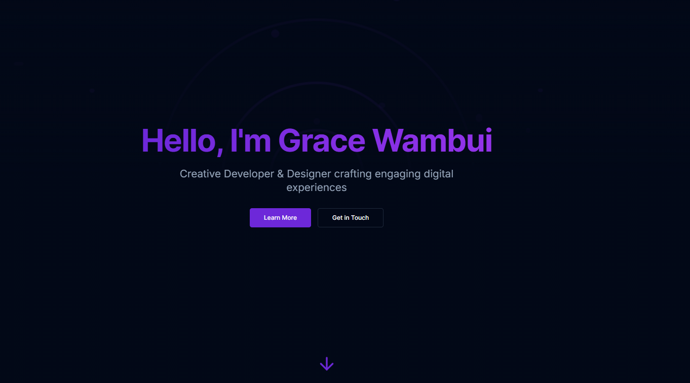

PortXfolio - Portfolio Website
A modern, interactive personal portfolio website built with Next.js and Tailwind CSS. This portfolio showcases projects, skills, and experience with an engaging user interface and several interactive features.

Portfolio Website

Features
Interactive UI - Modern, responsive design with animations
Dark/Light Theme - Fully customizable theme support
Projects Showcase - Filterable projects gallery with detailed project information
Interactive Timeline - Visual representation of professional journey
Personality Quiz - Interactive quiz for visitors to discover their developer personality type
Conversational Contact Form - Chat-like interface for contacting the portfolio owner
QR Code Generator - Dynamic QR codes for contact details
Achievement Badges - Gamified experience with unlockable badges for visitors
Chat Bot Assistant - AI-like chat interface to help visitors navigate the portfolio
Pages
Home - Welcoming landing page with introduction
About - Personal information, journey timeline, and personality quiz
Projects - Gallery of work with filterable categories
Contact - Interactive contact form and connection options
Tech Stack
Frontend Framework: Next.js
Styling: Tailwind CSS
Animations: Framer Motion
UI Components: Custom components using Radix UI primitives
Icons: Lucide Icons
QR Code Generation: QRCode.react

Installation
Clone the repository:

Navigate to the project directory:

Install dependencies:

Run the development server:

Open http://localhost:3000 in your browser to see the result.

Project Structure
Customization
The portfolio is designed to be easily customizable:

Edit your personal details in the respective page components
Add new projects to the projects array in page.tsx
Modify the timeline events in timeline.tsx
Customize styling through Tailwind classes or by modifying the theme in tailwind.config.ts